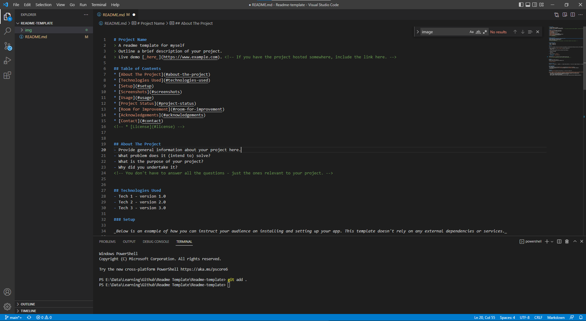

# Learning Terraform

[Markdown Badges][markdownbadges]
> Learning 
> Outline a brief description of your project.
> Live demo [_here_](https://www.example.com). <!-- If you have the project hosted somewhere, include the link here. -->

## Table of Contents
* [About The Project](#about-the-project)
* [Knowledge](#knowledge)
* [Technologies Used](#technologies-used)
* [Setup](#setup)
* [Screenshots](#screenshots)
* [Usage](#usage)
* [Project Status](#project-status)
* [Room for Improvement](#room-for-improvement)
* [Acknowledgements](#acknowledgements)
* [Contact](#contact)
<!-- * [License](#license) -->

## About The Project
- This repo use for my learning Terraform, include:
   - Basic setup Terraform, Service Principle connect to Azure Subscription
   - Learning Resource

<!-- You don't have to answer all the questions - just the ones relevant to your project. -->

## Knowledge
- [Terraform 70 labs](https://terraformguru.com/terraform-certification-using-azure-cloud/)
- [Prepare for Terraform Certification](https://developer.hashicorp.com/terraform/tutorials/certification-003)
- 

## Technologies Used
- Terraform: azurerm, random,...
- Azure: Resource Group, Vnet, Subnet, Public IP, NIC, NSG, Linux VM, Static Web, Storage Account,...

### Setup
- [Basic Terraform + Azure](https://developer.hashicorp.com/terraform/tutorials/azure-get-started/infrastructure-as-code)

## Screenshots
<!--  -->
<!-- If you have screenshots you'd like to share, include them here. -->

## Usage
How does one go about using it?
Provide various use cases and code examples here.

`write-your-code-here`

## Project Status
Project is: _in progress_ / _complete_ / _no longer being worked on_. If you are no longer working on it, provide reasons why.

## Acknowledgements
Give credit here.
- This readme project was inspired by [Rita Łyczywek][Rita] and [Othneil Drew][Drew]
- This project was based on [this tutorial][bulldogjob], [Best Readme Template][Best-Template] and [README-cheatsheet][readme-cheatsheet]
- [Markdown Cheatsheet][markdown-cheatsheet]
- Online markdown preview [Dillinger.io][dillinger]
- [Quickstart for writing on GitHub][quickstartmdgithub]
- Many thanks to...

## Contact
<!-- Created by [@flynerdpl](https://www.flynerd.pl/) - feel free to contact me! -->

[//]: # (These are reference links used in the body of this note and get stripped out when the markdown processor does its job. There is no need to format nicely because it shouldn't be seen. Thanks SO - http://stackoverflow.com/questions/4823468/store-comments-in-markdown-syntax)

[bulldogjob]: https://bulldogjob.com/readme/how-to-write-a-good-readme-for-your-github-project
[rita]: https://bulldogjob.com/readme/authors/rita-lyczywek
[Drew]: https://github.com/othneildrew
[Best-Template]: https://github.com/othneildrew/Best-README-Template/blob/master/README.md#readme-top
[markdown-cheatsheet]: https://github.com/adam-p/markdown-here/wiki/Markdown-Cheatsheet
[readme-cheatsheet]: https://github.com/ritaly/README-cheatsheet
[dillinger]: https://dillinger.io/
[quickstartmdgithub]: https://docs.github.com/en/get-started/writing-on-github/getting-started-with-writing-and-formatting-on-github/quickstart-for-writing-on-github
[markdownbadges]: https://github.com/Ileriayo/markdown-badges#-ci
